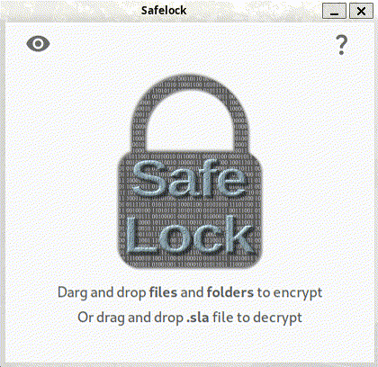

<p align='center'>
  
</p>

<p align='center'>
  <a href='https://github.com/mrf345/safelock/actions/workflows/ci.yml'>
    
  </a>
  
  
</p>

<p align='center'>
  Fast drag & drop cross-platform files encryption tool, based on <a href="https://github.com/mrf345/safelock-cli" target="_blank">safelock-cli</a> and built with
  <a href="https://github.com/wailsapp/wails" target="_blank">Wails</a> and <a href="https://github.com/angular/angular" target="_blank">Angular</a>.
</p>

<hr />

### Install

<details>
<summary><h5>Linux</h5></summary>

  - With `amd64` binary

  ```bash
  wget -qO- https://github.com/mrf345/safelock/releases/latest/download/safelock-linux-amd64.tar.gz | tar xvz -C ~ && ~/safelock
  ```

  - With `arm64` binary

  ```bash
  wget -qO- https://github.com/mrf345/safelock/releases/latest/download/safelock-linux-arm64.tar.gz | tar xvz -C ~ && ~/safelock
  ```

  - Or from the source code

    Make sure you have [go](https://go.dev/doc/install), [npm](https://nodejs.org/en/download/package-manager) and [git](https://git-scm.com/downloads) are installed, then run:

    ```bash
    go install github.com/wailsapp/wails/v2/cmd/wails@latest
    git clone https://github.com/mrf345/safelock.git
    cd safelock
    wails dev
    ```
</details>
<details>
<summary><h5>Windows</h5></summary>

  Download, extract and install [this](https://github.com/mrf345/safelock/releases/latest/download/safelock-windows-amd64.zip) or run [this portable version](https://github.com/mrf345/safelock/releases/latest/download/safelock-windows-portable-amd64.zip).

</details>
<details>
<summary><h5>MacOS</h5></summary>

  Download and extract [this universal .app](https://github.com/mrf345/safelock/releases/latest/download/safelock-darwin-universal.zip), Note that you'll need to enable installing apps from unknown developers follow [this guide](https://www.wikihow.com/Install-Software-from-Unsigned-Developers-on-a-Mac).

</details>


### Performance

The encryption should be about **19.5** times faster than `gpgtar` and **8.8** times faster than `7zip`. Check [safelock-cli/performance](https://github.com/mrf345/safelock-cli?tab=readme-ov-file#performance) for more details.

<p align="center">
  <a href="https://raw.githubusercontent.com/mrf345/safelock-cli/master/benchmark/encryption-time.webp" target="_blank">
    
  </a>
</p>


### Changelog

##### v1.0.0

Should expect great improvement in performance (about **23.2** times faster) compared to the last release `0.5`, with better overall encryption and cross-platform support.

However, this version **breaks backward compatibility**. Any files encrypted with a prior versions can't be decrypted with this version, and vice versa.

<a style="margin-top: 60px;" href="https://raw.githubusercontent.com/mrf345/safelock/master/docs/demo.gif" target="_blank">
  
</a>
